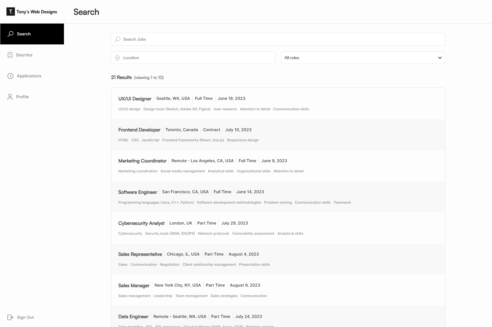
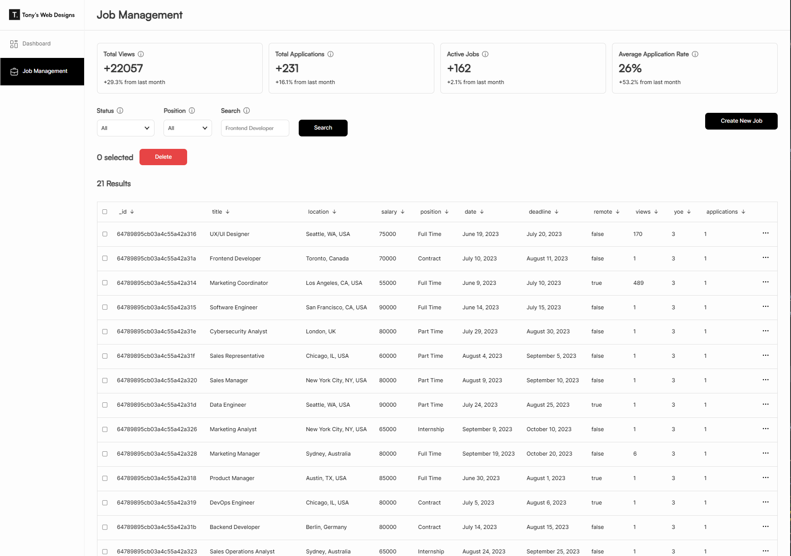
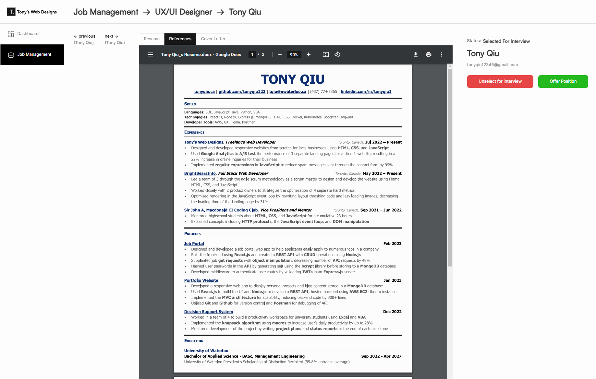
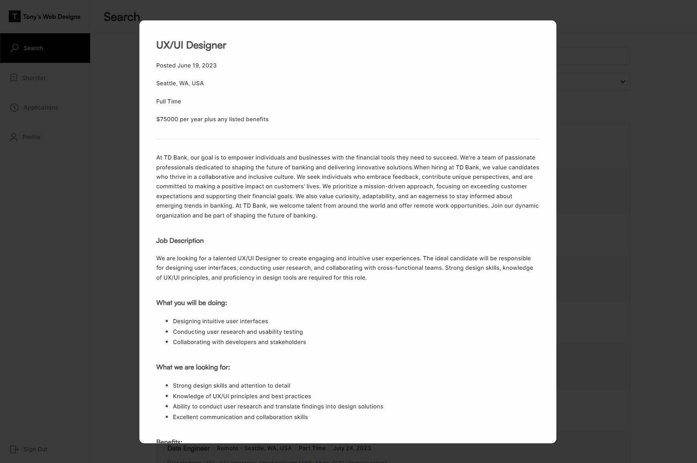

<!DOCTYPE html>
<html lang="en">
<head>
  <meta charset="UTF-8">
  <meta name="viewport" content="width=device-width, initial-scale=1.0"> 
</head>
<body>
  <header>
    <h1>Job Portal Web App</h1>
    
  </header>

  <section>
    <h2>Overview</h2>
     
    

      The Job Portal Web App is a platform designed to allow a single company with a team of administrators to efficiently post and manage job listings on their own website. This web app also syncs job postings with their accounts on popular job platforms such as LinkedIn, Glassdoor, ZipRecruiter, and SimplyHired, saving valuable time and effort. Additionally, the job portal enables users to apply to jobs efficiently by utilizing their applicant profiles, which include their resume and basic background information like name, email, and URLs.
    

  </section>

  <section>
    <h2>Technologies Used</h2>
    <ul>
      <li>Frontend: TypeScript and React</li>
      <li>Backend: Node.js, Express, and Mongoose</li>
      <li>Database: MongoDB</li>
    </ul>
  </section>

  <section>
    <h2>Getting Started</h2>
    <ol>
      <li>Clone the repository: <code>git clone https://github.com/your/repository.git</code></li>
      <li>Install the necessary dependencies: <code>npm install</code></li>
      <li>Create a <code>.env</code> file at the root of the project with the following properties:</li>
    </ol>
    <pre><code>
ADMIN_PASSWORD=&lt;admin_password_value&gt;
JWT_SECRET=&lt;jwt_secret_value&gt;
MONGO_URI=&lt;mongodb_cluster_key&gt;
    </code></pre>
    
Note: Set the <code>ADMIN_PASSWORD</code> to the desired value for the admin password. Choose a strong <code>JWT_SECRET</code> for securely signing JSON Web Tokens. Set the <code>MONGO_URI</code> to the connection string of your MongoDB cluster.

    <ol start="4">
      <li>Build the frontend: <code>npm run build</code></li>
      <li>Start the server: <code>npm start</code></li>
    </ol>
    
Ensure you have Node.js and MongoDB installed on your system to run the web app.

  </section>

  <section>
    <h2>Employer/Admin Usage</h2>
     
    <ol>
      <li>Open your web browser and navigate to <code>&lt;https://company-job-portal.netlify.app&gt;/admin/login</code></li>
      <li>Enter the value you set for <code>ADMIN_PASSWORD</code> in the <code>.env</code> file.</li>
    </ol>
  </section>

  <section>
    <h2>Job Seeker Usage</h2>
    
    <ol>
      <li>Open your web browser and go to <code>&lt;https://company-job-portal.netlify.app&gt;/sign-up</code></li>
      <li>Enter your first name, last name, email, and password.</li>
    </ol>
  </section>

  <section>
  <h2>Future Updates</h2>
  <ul>  
    <li>
      <strong>Monthly Statistics Storage:</strong> Implement functionality to store monthly statistics in the database for better data analysis and insights.
    </li>
    <li>
      <strong>Recent Job Applications View:</strong> Enhance the admin dashboard with the ability to view the most recent job applications, allowing for quicker and more efficient response times.
    </li>
    <li>
      <strong>Integration with Additional Job Platforms:</strong> Expand the list of integrated job platforms to provide a wider range of options for managing job listings.
    </li>
  </ul>
</section>

<footer>
  
Contact Information:

  

    For any inquiries or support regarding the Job Portal Web App, please reach out to me at <a href="tonyqiu12345@gmail.com">tonyqiu12345@gmail.com</a>.
  

</footer>

</body>
</html>

